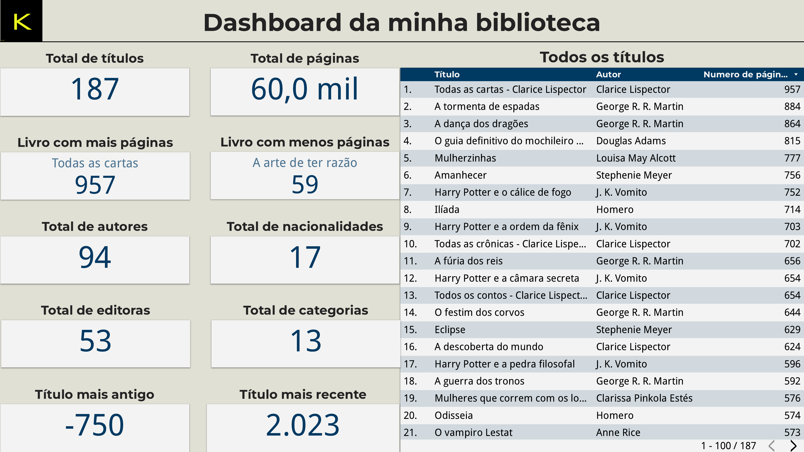
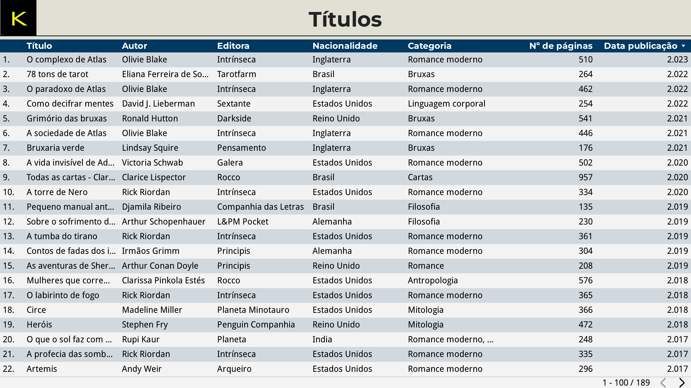
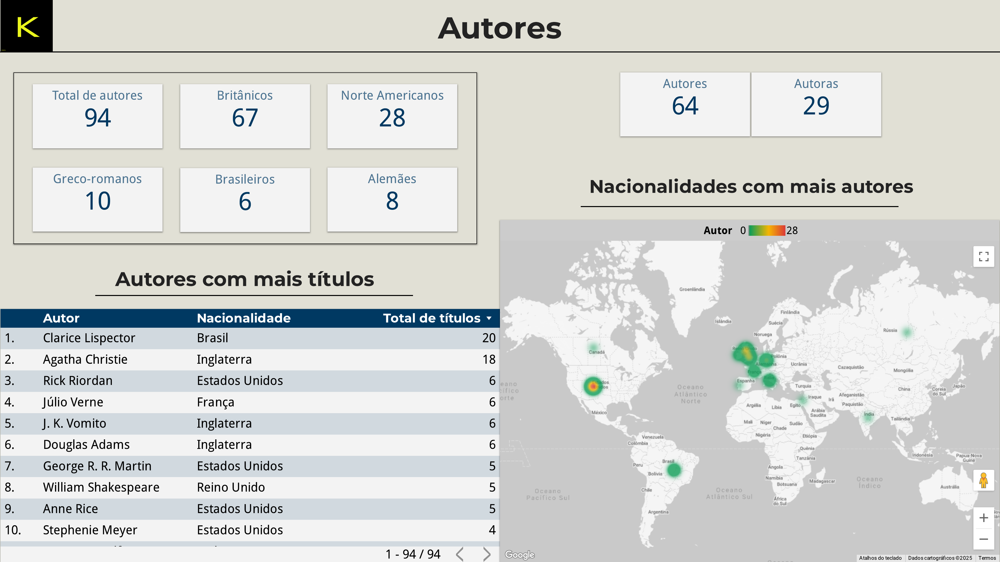
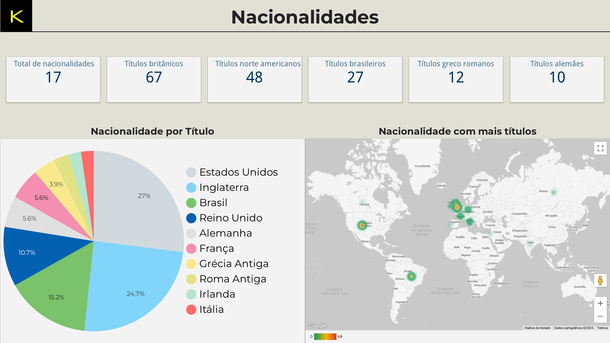
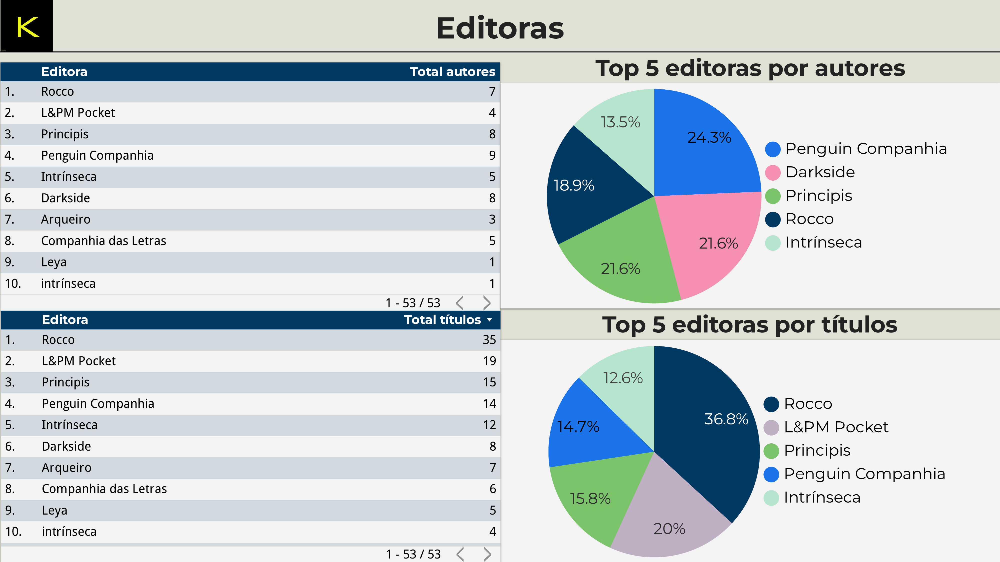
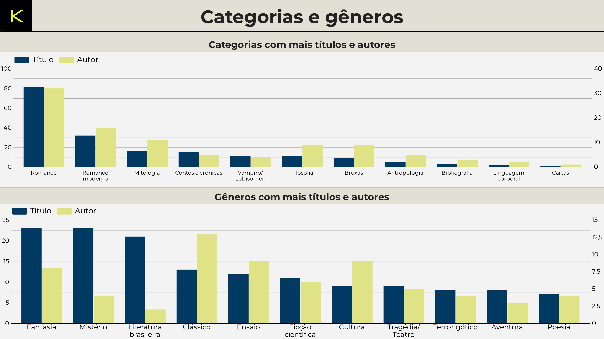
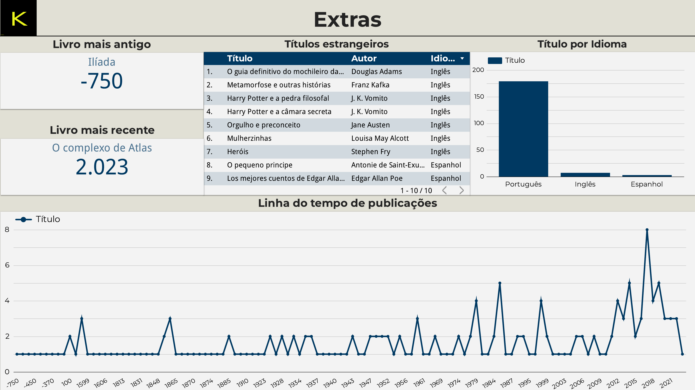

## Biblioteca pessoal — Projeto de organização de dados

Este projeto surgiu da vontade de organizar e visualizar dados sobre todos os livros físicos da minha biblioteca pessoal. A proposta foi usar ferramentas simples e gratuitas para transformar uma coleção de livros em um conjunto de dados bem estruturado, visualmente acessível e útil.

### Etapas do projeto

1. Criação de planilha no Excel  
   Cataloguei todos os livros físicos da minha estante.  
   Para cada título, adicionei informações como: autor, data de publicação original, nacionalidade do autor, editora, gênero, número de páginas, etc.  
   Quando essas informações não estavam disponíveis nos próprios livros, fiz pesquisas para preencher os dados (como a data de publicação original).

2. Inclusão de livros não fisicamente presentes  
   Usei fotos dos livros e informações de terceiros para incluir livros que possuo, mas não estão atualmente comigo.

4. Visualização no Looker Studio  
   Com a planilha organizada, importei os dados para o Looker Studio.  
   Criei um painel com sete páginas, cada uma focada em um aspecto diferente da coleção.

### Planilha base

[Planilha da biblioteca](./Biblioteca_pessoal.csv)

## Dashboards

Abaixo estão os painéis criados no Looker Studio. Cada seção pode ser expandida para visualizar os gráficos correspondentes.

  
1. Dashboard geral

  

  
2. Títulos

  

  
3. Autores

  

  
4. Nacionalidades

  

  
5. Editoras

  

  
6. Categorias e gêneros

  

  
7. Extras

  

### Dashboard interativo
[Acesse o dashboard interativo](https://lookerstudio.google.com/reporting/97266270-4ea4-44ac-972e-60047ec64c29)

### Considerações finais

Esse projeto une organização pessoal e análise de dados, usando ferramentas como Excel e Looker Studio para criar algo funcional, acessível e visual. É um exemplo de como qualquer conjunto de dados pode ganhar nova vida com as ferramentas certas.
Até mais, e obrigado pelos peixes 🐬
